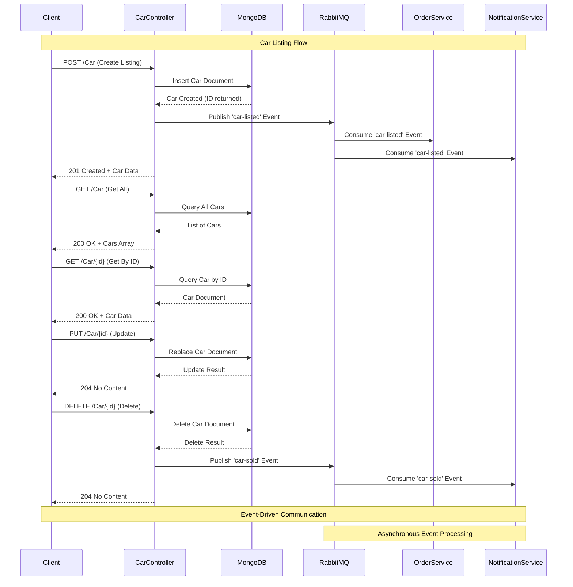
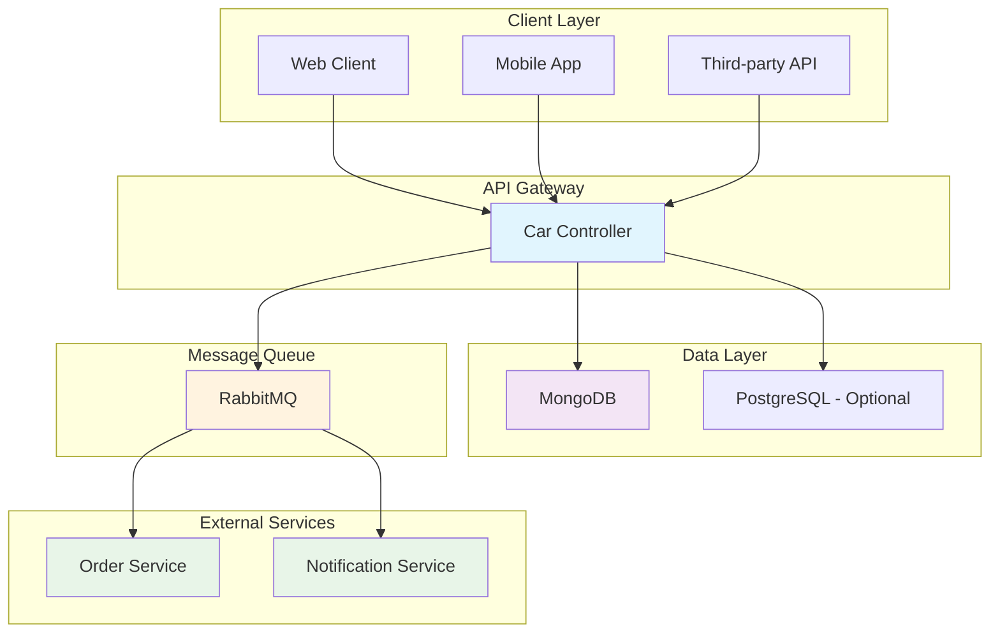

# Car Listing Service

Service for managing car listings (create, read, update, delete) backed by MongoDB.

## Tech Stack
- .NET 7 Web API
- MongoDB (database)
- RabbitMQ (planned for events)
- Swagger/OpenAPI

## Local URLs
- HTTP: `http://localhost:5033`
- HTTPS: `https://localhost:7219`
- Swagger UI: `/swagger`

## Features
- Create, update, delete car listings
- Manage car details (brand, model, year, mileage, condition, price, description)
- Planned events: `car-listed`, `car-sold`
- Communicates with order-service and notification-service (future work)

## System Architecture & Flow

### Sequence Diagram Overview



### Component Interaction Flow



### Data Flow Description

1. **Client Request**: External clients (web, mobile, APIs) send HTTP requests to the Car Controller
2. **Controller Processing**: The Car Controller validates requests and processes business logic
3. **Data Persistence**: Car data is stored in MongoDB (primary) or PostgreSQL (optional)
4. **Event Publishing**: After successful operations, events are published to RabbitMQ
5. **Service Communication**: Order Service and Notification Service consume events asynchronously
6. **Response**: Controller returns appropriate HTTP responses to clients

### Event Types

- **`car-listed`**: Published when a new car listing is created
- **`car-sold`**: Published when a car listing is deleted (assumed sold)

## Requirements
- .NET 7 SDK
- MongoDB running locally or in Docker

Start MongoDB quickly with Docker:
```bash
docker run -d --name mongo -p 27017:27017 mongo:6
```

## Configuration
Configuration lives in `appsettings.json` / `appsettings.Development.json`:

```json
{
  "ConnectionStrings": {
    "MongoDb": "mongodb://localhost:27017"
  }
}
```

The API connects to database `CarMarketplace`, collection `Cars`.

Environment: set `ASPNETCORE_ENVIRONMENT=Development` for local runs (profiles already do this).

## Getting Started
```bash
dotnet restore
dotnet run
```

On first run, open Swagger at `http://localhost:5033/swagger` (or the HTTPS variant).

## Data Model
`Car` document shape stored in MongoDB:

```json
{
  "id": "ObjectId as string",
  "brand": "string",
  "model": "string",
  "year": 2020,
  "mileage": 15000,
  "condition": "Excellent",
  "price": 24999.99,
  "description": "string"
}
```

## API Endpoints
Base route: `/Car`

- `GET /Car` — Get all car listings
- `GET /Car/{id}` — Get a car by id
- `POST /Car` — Create a new car listing
- `PUT /Car/{id}` — Replace/update a car listing by id
- `DELETE /Car/{id}` — Delete a car listing by id

### Request/Response Examples

Create:
```bash
curl -X POST http://localhost:5033/Car \
  -H 'Content-Type: application/json' \
  -d '{
    "brand": "Toyota",
    "model": "Camry",
    "year": 2021,
    "mileage": 10000,
    "condition": "Good",
    "price": 21000,
    "description": "One owner, clean"
  }'
```

Get by id:
```bash
curl http://localhost:5033/Car/<id>
```

Update:
```bash
curl -X PUT http://localhost:5033/Car/<id> \
  -H 'Content-Type: application/json' \
  -d '{
    "id": "<id>",
    "brand": "Toyota",
    "model": "Camry",
    "year": 2021,
    "mileage": 12000,
    "condition": "Very Good",
    "price": 20500,
    "description": "Price reduced"
  }'
```

Delete:
```bash
curl -X DELETE http://localhost:5033/Car/<id>
```

## Swagger
Interactive docs at `http://localhost:5033/swagger` in Development.

## MongoDB Tips
- Verify data: `mongosh` → `use CarMarketplace` → `db.Cars.find()`
- Ensure Mongo is reachable at the configured connection string

## Notes & Future Work
- Event publishing to RabbitMQ (`car-listed`, `car-sold`) is not implemented yet
- No authentication/authorization is configured yet
- Basic validation is not implemented; consider adding model validation

## Troubleshooting
- Connection refused to MongoDB: ensure Docker container/service is running and port 27017 is open
- Swagger not loading: verify the app is running with `ASPNETCORE_ENVIRONMENT=Development` and visit the HTTP port listed above